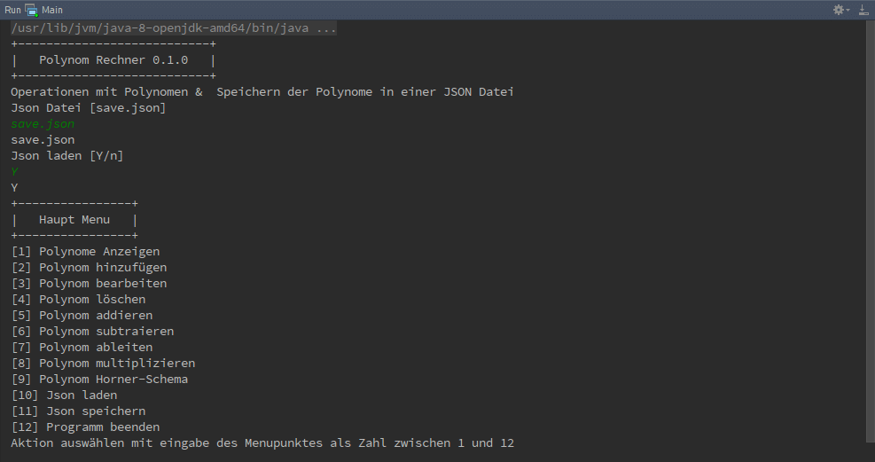

Über das Programm
-----------------
Das Programm "Polynomials Calculator" ist ein reines Konsolenprogramm, welches dazu dient Polynome
bis zum n Grad zu Addieren, Subtrahieren, Multiplizieren und Dividieren.

Es wird dem User ermöglicht Polynome in einer Json Datei zu sichern und zu laden um zu einen späteren
Zeitpunkt weiter damit zu arbeiten.

Nach dem starten wird der Wizard-Modus gestartet um Polynome aus einer Json Datei zu laden und anschließend
wird das Menü gestartet, welche sich so lange wiederholt bis der User das Programm über das Menü schließt.

In Menü kann der User Polynome hinzufügen, bearbeiten und löschen aber auch Mathematische Operationen
Addieren, Subtrahieren, Multiplizieren und Dividieren ausführen sowie die Polynome als Json sichern
oder neu von der Json einlesen.

- Quellcode: https://github.com/linuxluigi/polynomials-calculator
- Online Dokumentation: http://polynomials-calculator.readthedocs.io/de/latest/
.. index:: Git
.. index:: Quellcode
.. index:: Online Dokumentation

Abhänigkeiten
-------------
.. index:: Abhänigkeiten
Das Projekt wurde als Maven Modul geschrieben und verwendet folgende Module.

Maven Projekt Website: https://maven.apache.org/

Google GSON
^^^^^^^^^^^
.. index:: Google GSON
Gson ist eine Java Bibliothek die es ermöglicht Klassen und Variablen als Json Datei aus zu geben oder
ein String als Klasse oder Variable zu konvertieren.

| Name: google-gson
| Hersteller: Google Inc.
| Version: 2.7
| Link: https://github.com/google/gson

JUnit
^^^^^
.. index:: JUnit
Junit ist ein unit testing Framework für Java von Erich Gamma und Kent Beck.

| Name: JUnit
| Hersteller: Erich Gamma und Kent Beck
| Version: 4.12
| Link: http://junit.org/junit4/