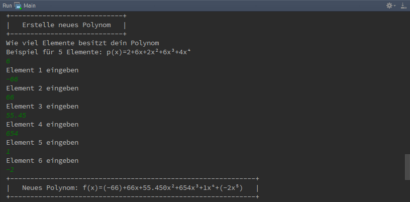

Hauptmenü
=========

Inhalt
^^^^^^
Das Hauptmenu besitzt 12 Optionen mit folgendem Inhalten.

+---------+-------------------------------------------------------------+
| Option  | Inhalt                                                      |
+=========+=============================================================+
| 1       | Alle Polynome anzeigen die im Polynomarray hinterlegt sind. |
+---------+-------------------------------------------------------------+
| 2  -  4 | Polynome hinzufügen, bearbeiten oder löschen.               |
+---------+-------------------------------------------------------------+
| 5  -  9 | Rechenoperationen mit Polynomen ausführen                   |
+---------+-------------------------------------------------------------+
| 10 - 11 | Json Datei Laden und Sichern                                |
+---------+-------------------------------------------------------------+
| 12      | Programm schließen                                          |
+---------+-------------------------------------------------------------+

|

.. image:: img/PolyCalc-Menu-1.png

Option 1: Alle Polynome anzeigen lassen
^^^^^^^^^^^^^^^^^^^^^^^^^^^^^^^^^^^^^^^
.. index:: Polynome anzeigen
Zeigt alle Polynome die dem Programm aktuell zu verfügung stehen. Die Polynome
werden untereinander aufgelistet und leicht lesbar Dargestellt. Die Zahl in der Eckigen Klammer [N]
dient der Übersicht, wieviele Polynome zu verfügung stehen.

.. image:: img/PolyCalc-Menu-2.png

Option 2: Polynom hinzufügen
^^^^^^^^^^^^^^^^^^^^^^^^^^^^
.. index:: Polynom hinzufügen
Als erstes wird aufgefordert die Länge des Polynomes ein zu geben. Die Länge heist in diesen Fall wie viele
Elemente das Polynom besitzt. Elemente mit den Wert 0 werden mitgezählt!

| Länge = Größter Exponent + 1

| Beispiel:
- `f(x)=5+(-16x)+(-9x³)+10x⁴+4x⁵` besitzt eine Länge von 6
- `f(x)=123.324+123x+56x²+(-5612.423x³)+654.234x⁴+5x⁵` besitzt eine Länge von 6
- `f(x)=+6x+2x²+3x³` besitzt eine Länge von 4

Nach der Eingabe der Länge wird aufgefordert jedes Element ein Wert aus dem Wertebereich der Reelen Zahlen
ein zu geben. Das Kommer für Reele Zahlen muss mit ein Punkt eingeben werden, ansonsten wird aufgeforert
das Element erneut ein zu geben.

Option 3: Polynom bearbeiten
^^^^^^^^^^^^^^^^^^^^^^^^^^^^
.. index:: Polynom bearbeiten
Um ein Polynom zu bearbeiten muss mindestens ein Polynom schon vorhanden sein. Sobald mindestens ein
Polynom vorhanden ist, erscheint die `Polynom Liste`, die Zahl in der Eckigen Klammer [] vor jedes
Polynom ist der Wert der eingeben werden muss, um dieses Polynom zu bearbeiten.

Nachdem das Polynom ausgewählt wurde, wird aufgefordert jedes Element ein neuen Wert zu zu weisen,
der Wert in der Eckigen Klammer nach `Element n []` ist der aktuelle Wert des Element und durch drücken
der Enter Taste ohne weitere Werte ein zu geben bleibt der alte Wert unverändert.

Zum schluss wird das bearbeitete Polynom angezeigt.

.. image:: img/PolyCalc-Menu-4.png
    :width: 75%
    :align: center

Option 3: Polynom löschen
^^^^^^^^^^^^^^^^^^^^^^^^^
.. index:: Polynom löschen
Sobald Polynom löschen ausgewählt wurde, erscheint die `Polynom Liste` woraus entschieden werden muss
welches Polynom gelöscht werden soll. Wenn die Zahl des Polynomes eingeben wurde, wird gefragt ob das
Polynom wirklich gelöscht werden soll, nur wenn 'y' oder 'Y' eingeben wurde, wird das Polynom wirlich
gelöscht.

Option 5, 6 & 8: Mathematische Operationen
^^^^^^^^^^^^^^^^^^^^^^^^^^^^^^^^^^^^^^^^^^
.. index:: Polynom Addition
.. index:: Polynom Subtraktion
.. index:: Polynom Multiplikation
Das Eingabemuster bei Addition, Subtraktion und Multiplikation ist das gleiche.

Es erscheint die `Polynom Liste` wo ausgewählt werden muss welches Polynom an erster Stelle Addiert,
Subtrahiert oder multipliziert werden soll und danach erscheint wieder die `Polynom Liste` wo ausgewählt
welches Polynom an zweiter stelle der Optertion stehen soll.

Nach erfolgreicher eingabe wird die Mathematische Operation ausgeführt und das so neu erstandene Polynom
wird angezeigt und in der Polynom Liste automatisch gesichert.

+------------------------------------+------------------------------------+------------------------------------+
| Addtion                            | Subtraktion                        | Multiplikation                     |
+====================================+====================================+====================================+
| .. image:: img/PolyCalc-Menu-6.png | .. image:: img/PolyCalc-Menu-7.png | .. image:: img/PolyCalc-Menu-8.png |
+------------------------------------+------------------------------------+------------------------------------+

Option 7: Polynom ableiten
^^^^^^^^^^^^^^^^^^^^^^^^^^
.. index:: Polynom ableiten
| In der erscheinenden `Polynom Liste` das gewünschte Polynom auswählen und es erscheint das abgeleitete Polynom.

Option 9: Polynom Division
^^^^^^^^^^^^^^^^^^^^^^^^^^
.. index:: Polynom Division
.. index:: Horner Schema

Die Polynom Division wird mit dem Hornerschema ausgeführt. Wie auch in anderen Polynom Mathematik Operationen muss
zuerst aus der `Polynom Liste` das gewünschte Polynom ausgewählt werden und danach den Divisor.

Es wird nun das neue geteilelte Polynom ausgegeben und der Rest von der Division.

Option 10: Json laden
^^^^^^^^^^^^^^^^^^^^^
.. index:: Json laden

Lädt die Polynome aus der Json Datei (festgelegt in Wizard am start des Programmes).

.. image:: img/PolyCalc-Menu-11.png
    :width: 75%
    :align: center

Option 11: Json speichern
^^^^^^^^^^^^^^^^^^^^^^^^^
.. index:: Json sichern

Sichert alle Polynome in die Json Datei, falls die Datei schon exiestiert wird sie mit den neuen Werten überschrieben.

.. image:: img/PolyCalc-Menu-12.png
    :width: 75%
    :align: center

Option 12: Programm beenden
^^^^^^^^^^^^^^^^^^^^^^^^^^^
.. index:: exit

Beenden das Programm mit einer freundlichen Verabschiedung.

